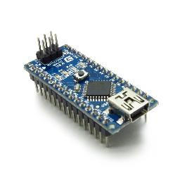

# Tea machine
Tea machine with arduino

### Steps
<pre>
1. I configure the initial position.
2. I wait until to cup is added
3. I turn on the green led. After that I raise the lever. I wait a few seconds for human add hot water and a tea bag
4. The green led blink much more fast when your time is finishing. Lets move on!!!
5. I under the lever with the tea bag.
6. And now magic's start. The Infusing the tea bag (up and down, up and down...).
7. At finish, I go up halfway, wait a few seconds for drip. (Yes, always drop some drips)
8. Wait a few seconds. I raise the lever to top level, and blink the green led while the buzzer sound.
9. Is finished!. Your tea is ready, please, remove the cup and enjoy an almost automated tea
</pre>

### Materials
 - Arduino nano
 - HC-SR04
 - servo-motor sg90
 - Protoboard
 - cable protoboard
 - Power 5v (or usb calbe to arduino)

### Conections

[Pending...]
